- [TÍTULO DE PROYECTO](#título-de-proyecto)
  - [Antecedentes](#antecedentes)
    - [Nombre del proyecto](#nombre-del-proyecto)
- [REQUISITOS](#requisitos)
  - [Requisitos funcionales](#requisitos-funcionales)
- [ANÁLISIS Y DISEÑO WEB](#análisis-y-diseño-web)
  - [Prototipo web y boceto de la estructura](#prototipo-web-y-boceto-de-la-estructura)
  - [Guía de estilos](#guía-de-estilos)
    - [Colores corporativos](#colores-corporativos)
    - [Logo](#logo)
  - [Planificación de tareas](#planificación-de-tareas)
  - [Base de datos](#base-de-datos)
    - [Diseño Entidad Relación de la BBDD](#diseño-entidad-relación-de-la-bbdd)
    - [Modelo relacional BBDD](#modelo-relacional-bbdd)
    - [Script de creación BBDD](#script-de-creación-bbdd)
      - [USUARIO:](#usuario)
      - [CLIENTE:](#cliente)
      - [TÉCNICO:](#técnico)
      - [GESTOR:](#gestor)
      - [DOMICILIO:](#domicilio)
      - [PRODUCTO:](#producto)
      - [PARTE:](#parte)
      - [TRABAJO:](#trabajo)
    - [Consultas](#consultas)
  - [Validación de formularios](#validación-de-formularios)
  - [Proceso de carga](#proceso-de-carga)
  - [Jerarquía de directorios](#jerarquía-de-directorios)
    - [Contenido directorios](#contenido-directorios)
  - [Diseño de la interface](#diseño-de-la-interface)
    - [Estructura gráfica de la interface](#estructura-gráfica-de-la-interface)
- [IMPLEMENTACIÓN](#implementación)
  - [REQUISITO 1: Diseño responsive](#requisito-1-diseño-responsive)
    - [Funcionamiento](#funcionamiento)
    - [Ejemplo de código](#ejemplo-de-código)
  - [REQUISITO 2: Control de vista según usuario](#requisito-2-control-de-vista-según-usuario)
    - [Funcionamiento](#funcionamiento-1)
    - [Ejemplo de código](#ejemplo-de-código-1)
  - [REQUISITO 3: Control de eliminación de datos](#requisito-3-control-de-eliminación-de-datos)
    - [Funcionamiento](#funcionamiento-2)
    - [Ejemplo de código](#ejemplo-de-código-2)
  - [REQUISITO 4: Control de errores en formularios](#requisito-4-control-de-errores-en-formularios)
    - [Funcionamiento](#funcionamiento-3)
    - [Ejemplo de código](#ejemplo-de-código-3)
  - [REQUISITO 5: Control de acceso de usuarios](#requisito-5-control-de-acceso-de-usuarios)
    - [Funcionamiento](#funcionamiento-4)
    - [Ejemplo de código](#ejemplo-de-código-4)
- [PRUEBAS](#pruebas)
  - [Metodología de las pruebas](#metodología-de-las-pruebas)
- [DESPLIEGUE](#despliegue)
- [HERRAMIENTAS](#herramientas)
- [LENGUAJES](#lenguajes)
- [PRODUCTO](#producto-1)
  - [Página de Inicio](#página-de-inicio)
- [BIBLIOGRAFÍA](#bibliografía)

# TÍTULO DE PROYECTO
## Antecedentes
### Nombre del proyecto

El proyecto se llamará Handyman. El nombre hace alusión al personaje de ficción Candyman. Teniendo en cuenta el significado de la palabra handyman (manitas) y el personaje en cuestión, quiero que se le asocie la facilidad de aparición de Candyman al nombrarlo con la rapidez de los técnicos para que asistan al cliente. Para ello será necesaria una aplicación óptima que permita a los distintos técnicos encontrar trabajos cercanos de manera sencilla y rápida.

Se han utilizado distintos lenguajes de programación, como pueden ser PHP y JavaScript para
su desarrollo, y para su diseño se ha hecho uso de Clip Studio y de estilos CSS...

# REQUISITOS

Una empresa dedicada a la gestión y reparación de electrodomésticos varios busca mejorar la experiencia del cliente y los trabajadores. Para ello, encarga una aplicación con la que los usuarios podrán dar partes de averías de aquellos productos que tengan registrados.
## Requisitos funcionales

- La aplicación deberá tener una parte visible para todo el público que acceda a esta. Aunque no esté registrado. Para ellos necesitaremos controlar el acceso a diferentes páginas según el rol del usuario.

- Los usuarios registrados pertenecerán a uno de los tres tipos de roles, dependiendo del tipo de usuario que sea podemos encontrar los siguientes.

  - Cliente: podrá consultar sus datos personales (domicilios registrados, productos, etc). Este usuario podrá reportar averías de aquellos productos que ya tenga registrados. 
  
  - Técnico: podrá consultar sus datos personales y aceptar trabajos de reportes activos en ese momento.
  
  - Gestor: podrá consultar, modificar y eliminar los datos de cualquier usuario registrado en la página, así como registrarlos y añadir productos o domicilios a clientes que lo requieran. El gestor es el único que puede dar de alta a los demás usuarios. 

- Si un cliente es eliminado, también deberán eliminarse aquellos datos asociados a este. Tales como productos, domicilios y partes. Si algunos de los partes fue aceptado por algún técnico, este trabajo también quedará inválido eliminándolo de la Base de datos

- Si un técnico es eliminado, cualquier trabajo que haya realizado se borrará. Si hay algún trabajo sin acabar, este se borrará igual y el estado del parte del cliente pasará a "LIBRE", para que otros técnicos puedan aceptarlo. 
  
- Diseño responsive
  
- Control de errores en formularios
  - DNI
  - Teléfono
  - Mail
  - Teléfono 
  - Dirección
  
- Acceso restringido a usuarios no registrados  

# ANÁLISIS Y DISEÑO WEB

Mapa web: 
Tenemos dos páginas comunes a todos los usuarios, que son la página de inicio y la de información sobre la empresa.
Según el tipo de usuario, tendrá acceso a unas páginas u otras controlando el acceso y cambiando la barra de navegación.

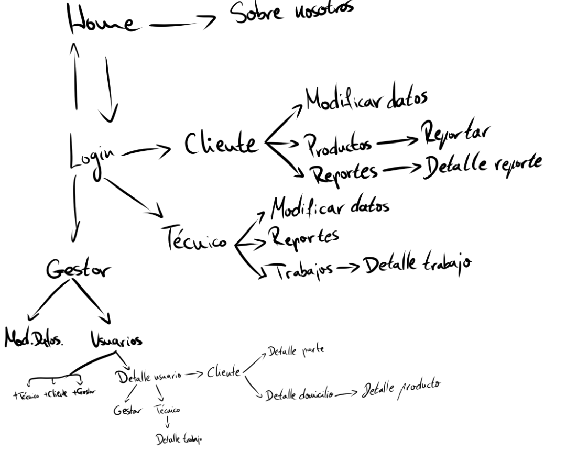

## Prototipo web y boceto de la estructura

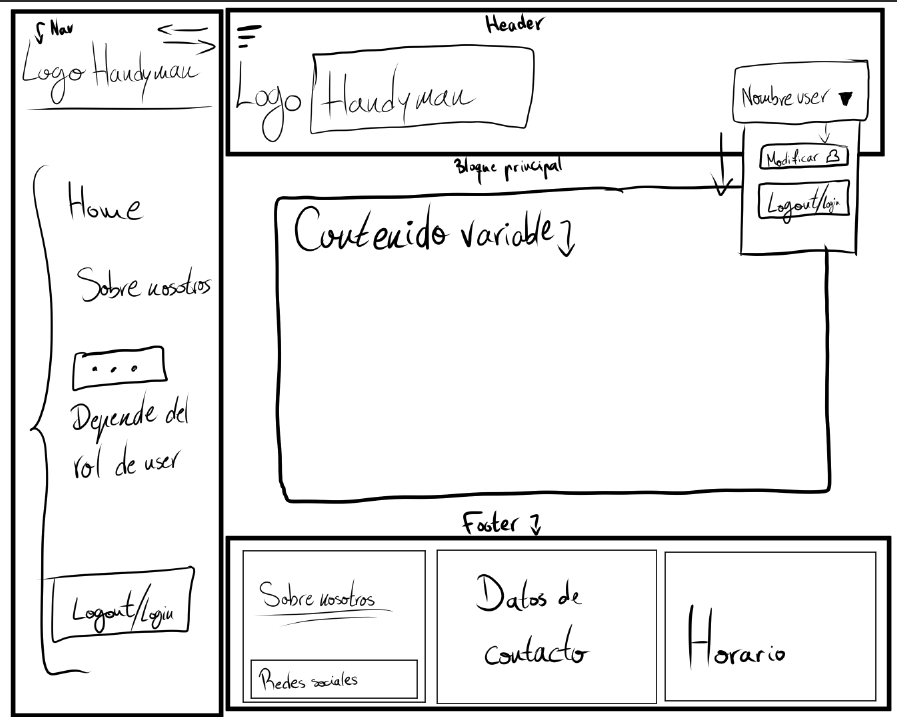
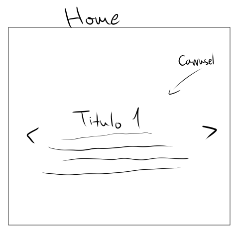
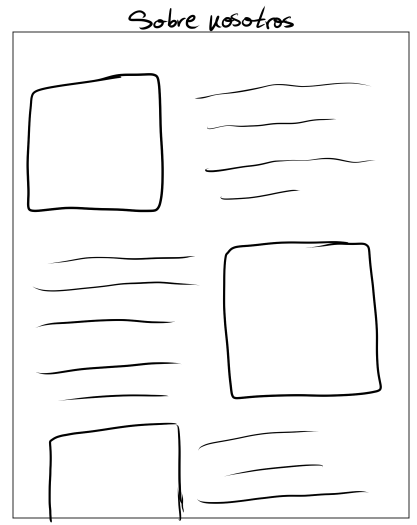
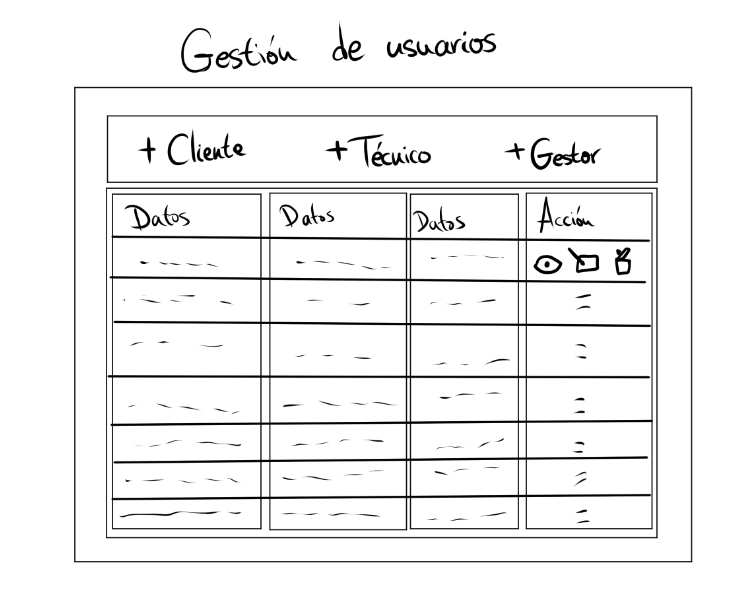
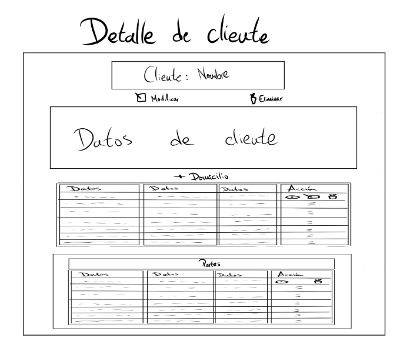
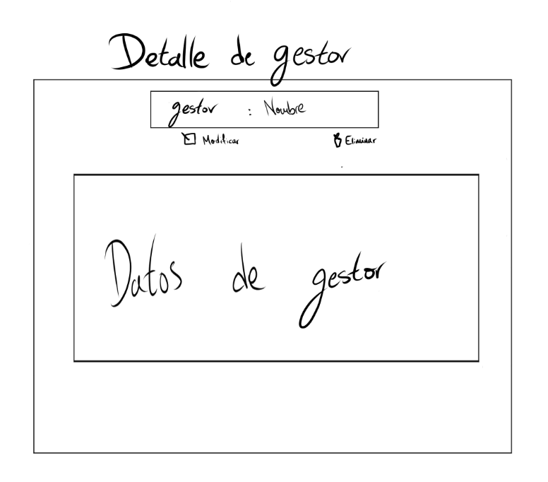
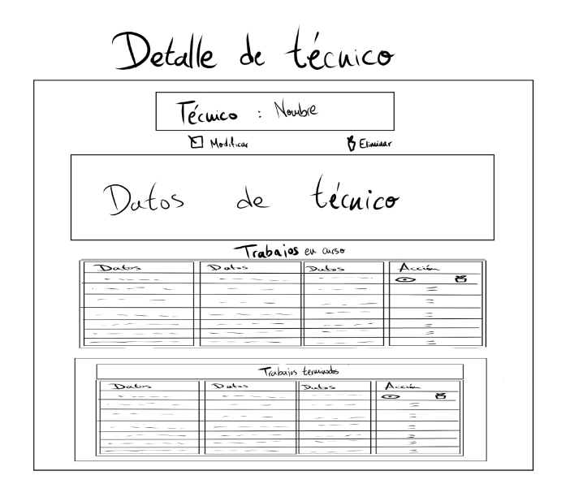
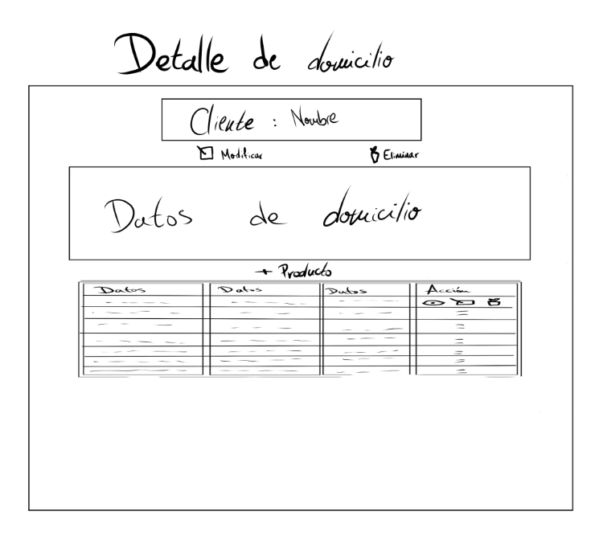
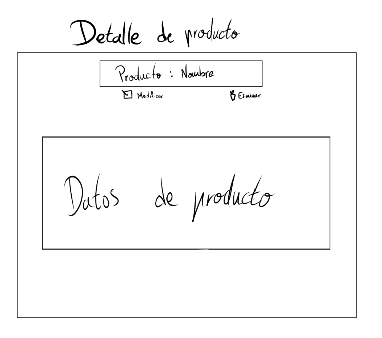

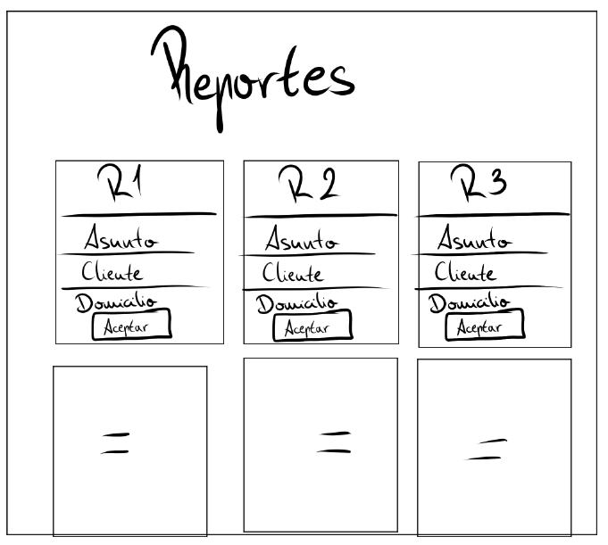
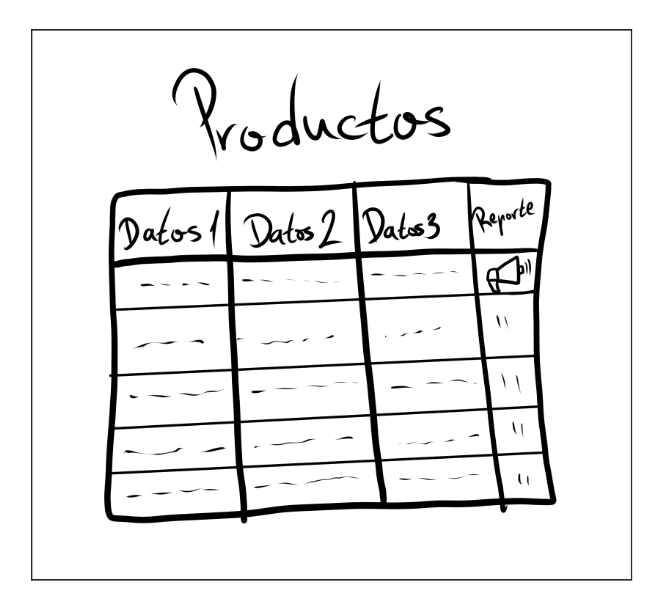
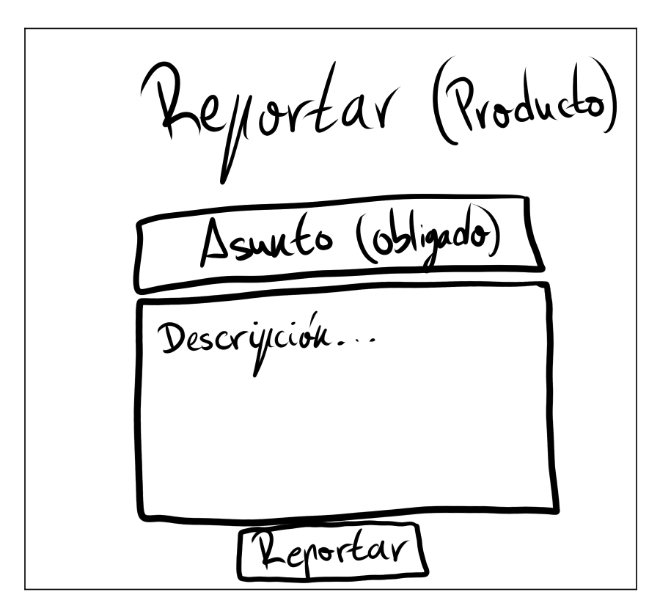
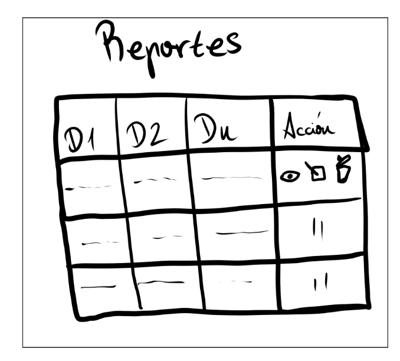

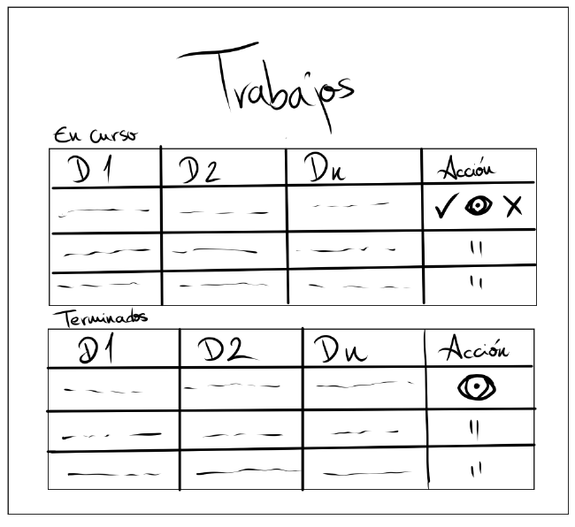
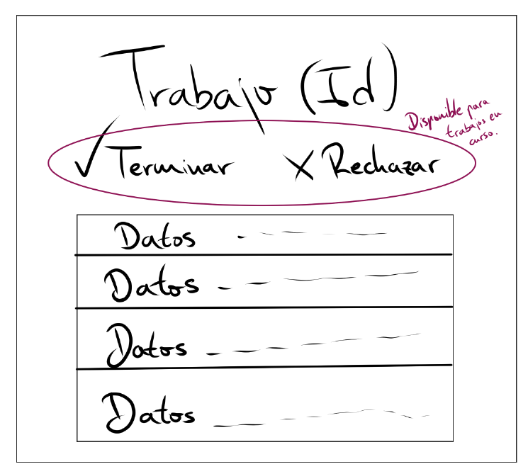
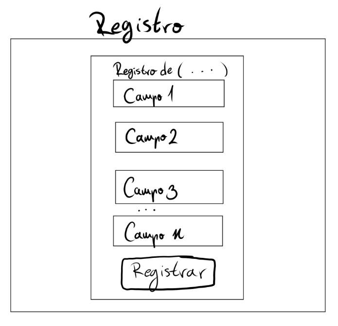
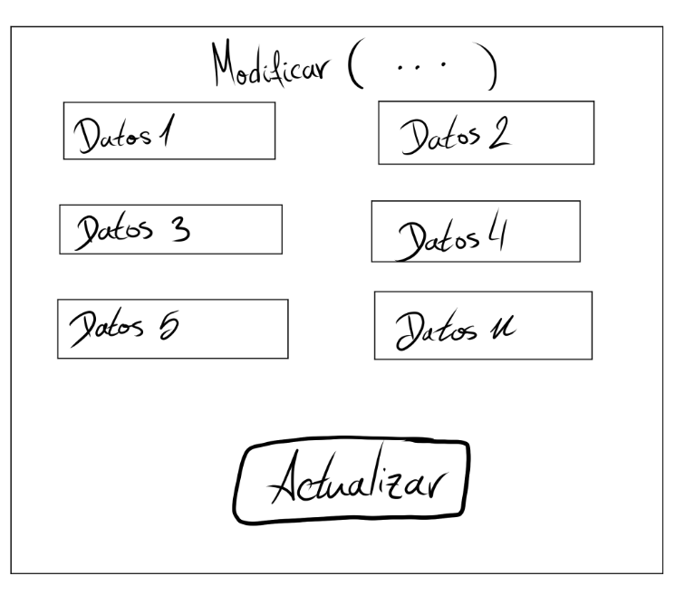
## Guía de estilos

### Colores corporativos

Los colores corporativos de Handyman son el morado y amarillo. La elección de estos colores, a parte de gusto personal al ver cómo combinan, es por los siguientes motivos:

- Morado: escogí el morado ya que es un color que transmite elegancia y seriedad. También pienso que puede equilibrar el color amarillo que también presenta la empresa para que no sea tan intrusivo a la vista.
- Amarillo: el color amarillo es escogido para transmitir alegría, optimismo y cercanía al cliente. 

### Logo

El logo de la empresa son dos manos ofreciendo una herramienta a modo de caramelo. Volviendo al tema de la elección del nombre "handyman", expliqué que era una referencia a la leyenda urbana "candyman", candy (caramelo). 

Es un logo que, al igual que el amarillo, transmite cercanía y ofrece ayuda al cliente. La empresa se dedica a la reparación de electrodomésticos por lo que, una llave inglesa, es símbolo indiscutible de esto. 

El logo fue diseñado con Clip Studio Paint, un editor de imágenes profesional que permite la creación de imágenes vectoriales.

## Planificación de tareas

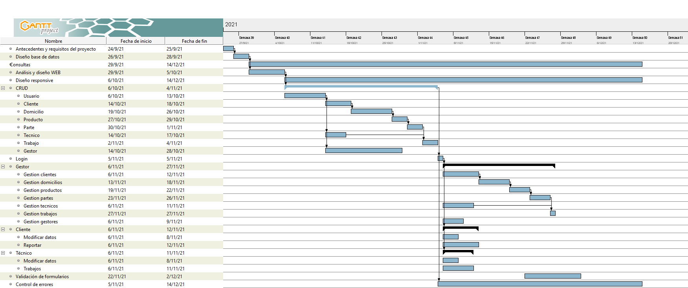

## Base de datos
### Diseño Entidad Relación de la BBDD

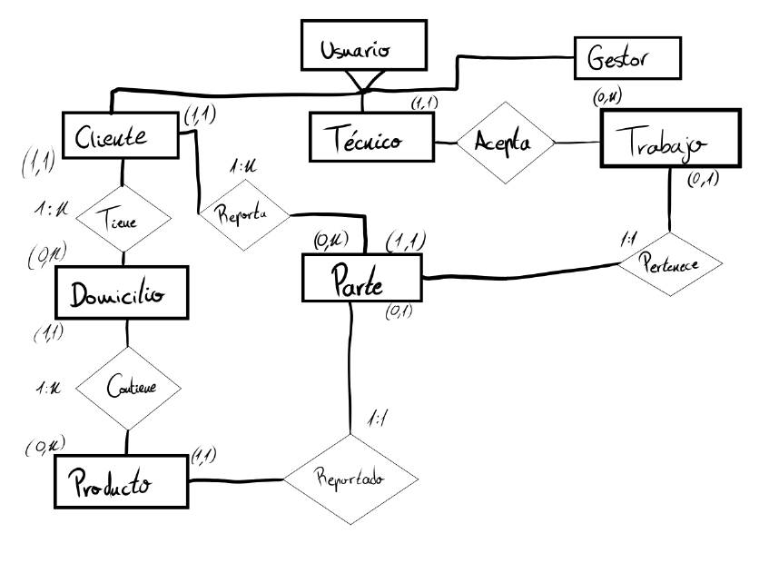

### Modelo relacional BBDD

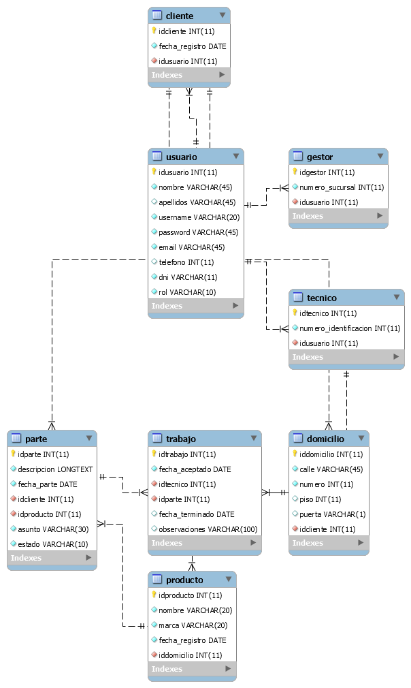

### Script de creación BBDD

#### USUARIO:

CREATE TABLE `usuario` (
  `idusuario` int(11) NOT NULL AUTO_INCREMENT,
  `nombre` varchar(45) NOT NULL,
  `apellidos` varchar(45) DEFAULT NULL,
  `username` varchar(20) NOT NULL,
  `password` varchar(45) NOT NULL,
  `email` varchar(45) NOT NULL,
  `telefono` int(11) DEFAULT NULL,
  `dni` varchar(11) NOT NULL,
  `rol` varchar(10) NOT NULL,
  PRIMARY KEY (`idusuario`),
  UNIQUE KEY `idusuario_UNIQUE` (`idusuario`),
  UNIQUE KEY `username_UNIQUE` (`username`),
  UNIQUE KEY `email_UNIQUE` (`email`),
  UNIQUE KEY `dni_UNIQUE` (`dni`)
) ENGINE=InnoDB AUTO_INCREMENT=19 DEFAULT CHARSET=latin1;

#### CLIENTE:

CREATE TABLE `cliente` (
  `idcliente` int(11) NOT NULL AUTO_INCREMENT,
  `fecha_registro` date NOT NULL,
  `idusuario` int(11) NOT NULL,
  PRIMARY KEY (`idcliente`),
  UNIQUE KEY `idcliente_UNIQUE` (`idcliente`),
  UNIQUE KEY `idusuario_UNIQUE` (`idusuario`),
  KEY `idusuario_idx` (`idusuario`),
  CONSTRAINT `idusuarioC` FOREIGN KEY (`idusuario`) REFERENCES `usuario` (`idusuario`) ON DELETE NO ACTION ON UPDATE NO ACTION
) ENGINE=InnoDB AUTO_INCREMENT=7 DEFAULT CHARSET=latin1;

#### TÉCNICO:

CREATE TABLE `tecnico` (
  `idtecnico` int(11) NOT NULL AUTO_INCREMENT,
  `numero_identificacion` int(11) NOT NULL,
  `idusuario` int(11) NOT NULL,
  PRIMARY KEY (`idtecnico`),
  UNIQUE KEY `idtecnico_UNIQUE` (`idtecnico`),
  UNIQUE KEY `numero_identificacion_UNIQUE` (`numero_identificacion`),
  UNIQUE KEY `idusuario_UNIQUE` (`idusuario`),
  CONSTRAINT `idusuarioT` FOREIGN KEY (`idusuario`) REFERENCES `usuario` (`idusuario`) ON DELETE NO ACTION ON UPDATE NO ACTION
) ENGINE=InnoDB AUTO_INCREMENT=2 DEFAULT CHARSET=latin1;

#### GESTOR:

CREATE TABLE `gestor` (
  `idgestor` int(11) NOT NULL AUTO_INCREMENT,
  `numero_sucursal` int(11) NOT NULL,
  `idusuario` int(11) NOT NULL,
  PRIMARY KEY (`idgestor`),
  UNIQUE KEY `idgestor_UNIQUE` (`idgestor`),
  KEY `idusuario_idx` (`idusuario`),
  CONSTRAINT `idusuarioG` FOREIGN KEY (`idusuario`) REFERENCES `usuario` (`idusuario`) ON DELETE NO ACTION ON UPDATE NO ACTION
) ENGINE=InnoDB AUTO_INCREMENT=2 DEFAULT CHARSET=latin1;

#### DOMICILIO:

CREATE TABLE `domicilio` (
  `iddomicilio` int(11) NOT NULL AUTO_INCREMENT,
  `calle` varchar(45) NOT NULL,
  `numero` int(11) NOT NULL,
  `piso` int(11) DEFAULT NULL,
  `puerta` varchar(1) DEFAULT NULL,
  `idcliente` int(11) NOT NULL,
  PRIMARY KEY (`iddomicilio`),
  UNIQUE KEY `iddomicilio_UNIQUE` (`iddomicilio`),
  KEY `idcliente_idx` (`idcliente`),
  CONSTRAINT `idclienteD` FOREIGN KEY (`idcliente`) REFERENCES `cliente` (`idcliente`) ON DELETE NO ACTION ON UPDATE NO ACTION
) ENGINE=InnoDB AUTO_INCREMENT=14 DEFAULT CHARSET=latin1;

#### PRODUCTO: 

CREATE TABLE `producto` (
  `idproducto` int(11) NOT NULL AUTO_INCREMENT,
  `nombre` varchar(20) NOT NULL,
  `marca` varchar(20) NOT NULL,
  `fecha_registro` date NOT NULL,
  `iddomicilio` int(11) NOT NULL,
  PRIMARY KEY (`idproducto`),
  UNIQUE KEY `idproducto_UNIQUE` (`idproducto`),
  KEY `iddomicilio_idx` (`iddomicilio`),
  CONSTRAINT `iddomicilioP` FOREIGN KEY (`iddomicilio`) REFERENCES `domicilio` (`iddomicilio`) ON DELETE NO ACTION ON UPDATE NO ACTION
) ENGINE=InnoDB AUTO_INCREMENT=27 DEFAULT CHARSET=latin1;

#### PARTE: 

CREATE TABLE `parte` (
  `idparte` int(11) NOT NULL AUTO_INCREMENT,
  `descripcion` longtext NOT NULL,
  `fecha_parte` date NOT NULL,
  `idcliente` int(11) NOT NULL,
  `idproducto` int(11) NOT NULL,
  `asunto` varchar(30) NOT NULL,
  `estado` varchar(10) NOT NULL,
  PRIMARY KEY (`idparte`),
  UNIQUE KEY `idparte_UNIQUE` (`idparte`),
  KEY `idcliente_idx` (`idcliente`),
  KEY `idproducto_idx` (`idproducto`),
  CONSTRAINT `idclienteP` FOREIGN KEY (`idcliente`) REFERENCES `cliente` (`idcliente`) ON DELETE NO ACTION ON UPDATE NO ACTION,
  CONSTRAINT `idproductoP` FOREIGN KEY (`idproducto`) REFERENCES `producto` (`idproducto`) ON DELETE NO ACTION ON UPDATE NO ACTION
) ENGINE=InnoDB AUTO_INCREMENT=6 DEFAULT CHARSET=latin1;

#### TRABAJO:

CREATE TABLE `trabajo` (
  `idtrabajo` int(11) NOT NULL AUTO_INCREMENT,
  `fecha_aceptado` date NOT NULL,
  `idtecnico` int(11) NOT NULL,
  `idparte` int(11) NOT NULL,
  `fecha_terminado` date DEFAULT NULL,
  `observaciones` varchar(100) DEFAULT NULL,
  PRIMARY KEY (`idtrabajo`),
  UNIQUE KEY `idtrabajo_UNIQUE` (`idtrabajo`),
  KEY `idtecnico_idx` (`idtecnico`),
  KEY `idparte_idx` (`idparte`),
  CONSTRAINT `idparteT` FOREIGN KEY (`idparte`) REFERENCES `parte` (`idparte`) ON DELETE NO ACTION ON UPDATE NO ACTION,
  CONSTRAINT `idtecnicoT` FOREIGN KEY (`idtecnico`) REFERENCES `tecnico` (`idtecnico`) ON DELETE NO ACTION ON UPDATE NO ACTION
) ENGINE=InnoDB AUTO_INCREMENT=5 DEFAULT CHARSET=latin1;

### Consultas 

**Consultas de inserción:**
Se han integrado consultas del tipo INSERT INTO para insertar determinados datos de las siguientes tablas:
Usuario, Cliente, Técnico, Gestor, Producto, Domicilio, Parte y Trabajo.
Un ejemplo de estas consultas puede ser la siguiente:

***INSERT INTO usuario (nombre, apellidos, username, password, email, telefono, dni, rol)***

**Consultas de eliminación:**
Para eliminar determinados datos de una tabla, se ha utilizado DELETE FROM. Esta es una consulta simple, pues solo pasamos la clave primaria como parámetro para identificar el elemento que queremos borrar.

***DELETE FROM usuario WHERE idusuario='$id'***

**Consultas de modificación:**
Para modificar determinados datos se ha utilizado UPDATE y se le ha pasado por parámetros aquellos datos que queremos modificar. En el caso de los usuarios, por ejemplo, hemos decidido que campos como DNI, que son únicos y no varían a lo largo del tiempo, no puedan modificarse. 

***UPDATE usuario SET username='$username', nombre='$nombre', apellidos='$apellidos', email='$email', telefono='$telefono' WHERE idusuario='$id'***

Otras tablas, como Parte, tienen un modificador que solo actualiza su estado:

***UPDATE parte SET estado='$estado' WHERE idparte='$id'***

**Consultas de lectura:**
Dependiendo del tipo de datos que queramos recoger se han realizado unas consultas u otras. Podemos diferenciar dos tipos esencialmente:

El primero, una consulta general de una tabla específica:
***SELECT * FROM `usuario`***

El segundo, consultas más específicas pasando por parámetros datos únicos para identificar elementos de una tabla en específico:
***SELECT * FROM usuario WHERE username='$username' LIMIT 1***

## Validación de formularios

Para la validación de formularios se ha utilizado Javascript. Los formularios de la página son sencillos y muy similares, por lo que los scripts son muy parecidos entre sí.
Se le han asignado a cada uno de los campos una expresión regular determinada (acorde con el tipo de campo y los requisitos). Tras esto, se ha verificado que cada campo sea rellenado correctamente, de lo contrario, el botón de submit no hará su trabajo. 
Los formularios de la página son los de creación o inserción de elementos a las tablas (como cliente, producto, etc), el login, la modificación de datos personales y la creación de un reporte.

Ejemplo de registro de técnico:
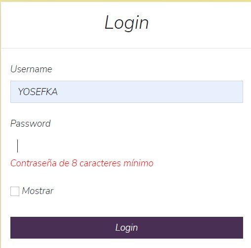
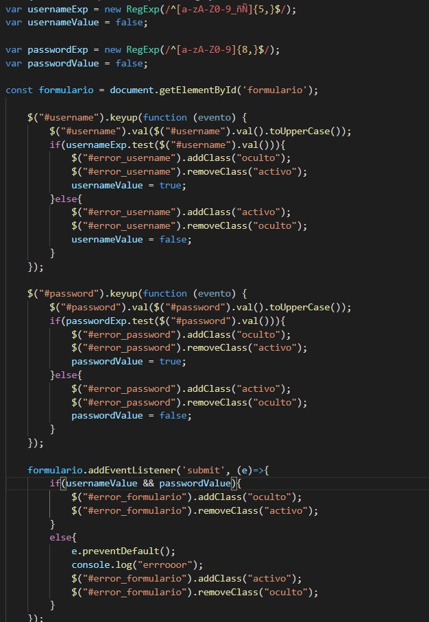

## Proceso de carga

Al haber desarrollado la página mediante el patrón MVC, el proceso de carga es muy intuitivo e identificable. Tenemos un archivo principal (index.php) que se encargará de cargar los controladores requeridos para cada página o función. Estos controladores recibirán los datos del modelo en cuestión y devolverán una vista con dichos datos. 
Esta manera de programar es utilizada por frameworks como Symfony o Laravel.

Esta es una imagen con la estructura del proceso de carga de MVC:
>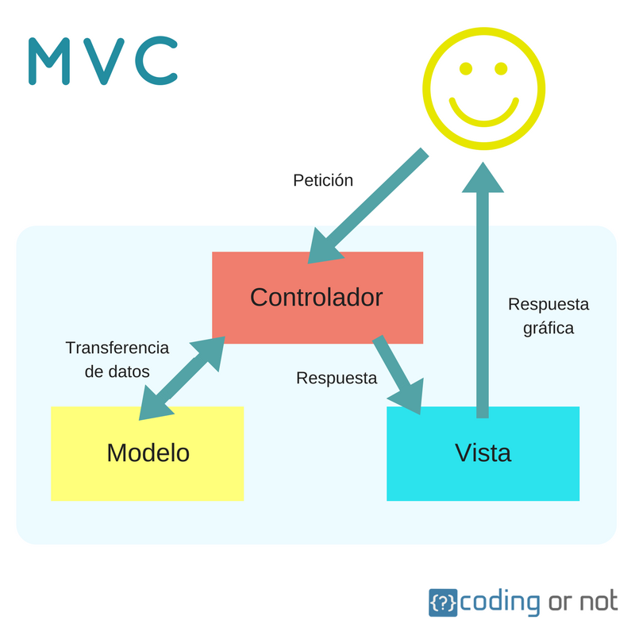

## Jerarquía de directorios

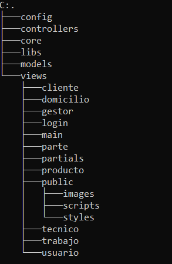

### Contenido directorios

Breve explicación de lo que tenemos contenido en cada directorio. Por ejemplo:

> `./` -> Contiene el fichero principal “index.php”, que se encargará de cargar los controladores.
> 
> `config` -> Contiene un archivo php para la carga automática de controladores.
> 
> `controllers` -> Contiene los archivos de controladores.
> 
> `core` -> Contiene un archivo con la lógica de carga de controladores.
> 
> `libs` -> Contiene el archivo para conectar la app con la base de datos.
> 
> `models` -> Contiene los archivos con los modelos de las distintas entidades.
> 
> `views` -> Contiene los directorios con las vistas.
> 
> `cliente, domicilio, gestor, login, main, parte, producto, tecnico, trabajo y usuario` -> Contienen los archivos con las vistas de cada directorio.
> 
> `partials` -> Contiene los archivos "estáticos" o que no varían de la página, como el header o el footer.
> 
> `public` -> Contiene los archivos necesarios para la implementación de las vistas.
> 
> `images` -> Contiene las imágenes que utilizaremos en la app.
> 
> `scripts` -> Contiene los archivos js.
> 
> `styles` -> Contiene los archivos css.
> 

## Diseño de la interface

En base al apartado [Prototipo web y boceto de la estructura](#prototipo-web-y-boceto-de-la-estructura) describimos el contenido de la interface de nuestra aplicación. Por ejemplo:

> El sitio web consta de cuatro partes fundamentales. Esta estructura es común en todas las páginas que forman el sitio web.
> 
> **Cabecera**: Contiene el logo de la empresa y el nombre. En este apartado encontramos también, a la derecha, el nombre del usuario que estuviera registrado o, en su defecto, la palabra 'login' para los usuarios no logueados.
> 
> **Barra de navegación**: Esta ubicada a la izquierda de la página, como desplegable para no entorpecer al contenido central. Contiene los enlaces a las páginas: home, sobre nosotros y login/logout. Dependiendo del rol del usuario logueado, contendrá, además, los enlaces hacia las demás páginas. 
> En el caso de cliente: productos y reportes.
> En el caso de Técnico: reportes y trabajos.
> En el caso de Gestor: usuarios y reportes.
> 
>**Contenido central**: Irá variando según en qué página estemos. Es la única parte "dinámica" de la página.
> 
>**Footer**: Se encuentra al final de la página, debajo del contenido central. En él podemos encontrar datos como el contacto, horario, ubicación y un link hacia la página "sobre nosotros".

### Estructura gráfica de la interface

# IMPLEMENTACIÓN

Descripción detallada de cada requisito, incluyendo su funcionamiento, validaciones si fuesen necesarias, y cualqier información relevante.

**Por ejemplo:**

## REQUISITO 1: Diseño responsive

Cada vez hay mas usuarios de Internet que utilizan dispositivos móviles para navegar. Si nos fijamos en la analítica de nuestra web, nos damos cuenta que cada vez hay un gran numero de visitas que provienen de dispositivos móviles, por lo que las resoluciones a las cuales vemos nuestro desarrollo son diferentes.

La principal necesidad que existe para hacer un diseño «adaptable», es porque se pierden bastantes visitantes, al no tener el site adaptable a todos.
### Funcionamiento

Para incluir un diseño responsive en la WEB se ha empleado CSS, y el framework Bootstrap.
### Ejemplo de código

Para el footer se ha empleado el siguiente código:

div class="col-lg-4 col-md-6 mb-4 mb-md-0"

Donde le decimos a ese trozo de código que ocupe un numero determinado de columnas según el tamaño de la pantalla

## REQUISITO 2: Control de vista según usuario

Para que haya un orden claro en la página y una distinción entre roles de usuario, se requiere implementar un control de vista para cada tipo de usuario.
### Funcionamiento

Para incluir este control en la WEB se ha empleado PHP y HTML.
### Ejemplo de código

if($_SESSION['rol']=='CLIENTE'):
...
elseif($_SESSION['rol']=='TECNICO'):
...
elseif($_SESSION['rol']=='GESTOR'):
...

## REQUISITO 3: Control de eliminación de datos

Para evitar errores a la hora de eliminar datos se ha controlado mediante php y la lógica que se elimine antes los datos necesarios.
### Funcionamiento

Para incluir este control en la WEB se ha empleado PHP.
### Ejemplo de código

foreach($data["partes"] as $parteAux){
  if($data['producto']['idproducto'] == $parteAux['idproducto']){
    if($trabajoAux = $trabajo->get_trabajo_parte($parteAux['idparte'])){
      $trabajo->eliminarTrabajo($trabajoAux['idtrabajo']);
    }
    $parte->eliminarParte($parteAux['idparte']);
  }
}

## REQUISITO 4: Control de errores en formularios

Es necesario validar cualquier dato que se introduzca por parte del cliente para controlar y dar una mejor experiencia al usuario.
### Funcionamiento

Para incluir este control en la WEB se ha empleado Javascript y el framework JQuery.
### Ejemplo de código

formulario.addEventListener('submit', (e)=>{
        if(usernameValue && passwordValue){
            $("#error_formulario").addClass("oculto");
            $("#error_formulario").removeClass("activo");
        }
        else{
            e.preventDefault();
            console.log("errrooor");
            $("#error_formulario").addClass("activo");
            $("#error_formulario").removeClass("oculto");
        }
    });

## REQUISITO 5: Control de acceso de usuarios

Es necesario que haya un control de acceso de usuarios para que, por ejemplo, un cliente no pueda acceder a los mismos paneles que un técnico.
### Funcionamiento

Para incluir este control en la WEB se ha empleado PHP.
### Ejemplo de código

<?php 
    if($_SESSION['rol']!='GESTOR'){
        header('Location: index.php?c=Main');
    } 
?>

# PRUEBAS

Breve descripción de cómo se han realizado las pruebas. Por ejemplo:

> Para la realización de las pruebas he montado una máquina virtual con linux + apache + mysql + php.
> 
> A lo largo del desarrollo he subido diferentes versiones y comprobado las diferentes funcionalidades.

## Metodología de las pruebas

Descripción de las pruebas que se han realizado para probar el funcionamiento de toda la aplicación. 

Imprescindible comprobar el CRUD y el acceso público y privado de nuestra aplicación.

# DESPLIEGUE

Creación de un Script en BASH que permita el despliegue en automático de la aplicación en cualquier servidor linux, que contenga un Apache+PHP y una base de datos SQL.

Se copia y describe el funcionamiento del script.

# HERRAMIENTAS

Descripción de todas las herramientas que se han usado para el desarrollo del proyecto. Por ejemplo:

> Para la realización del proyecto se han empleado las siguientes herramientas:
> ## Visual Studio
> 
> Es un editor de código fuente desarrollado por Microsoft para Windows , Linux y macOS . Incluye soporte para depuración , control de Git integrado, resaltado de sintaxis , finalización de código inteligente , fragmentos de código y refactorización de código . Es gratuito y de código abierto.
> 
> ### Características
> 
> Control de GIT para subir y actualizar el repositorio de GitHub
> 
> ## Bootstrap
> 
> Bootstrap es un framework CSS y Javascript diseñado para la creación de interfaces limpias y con un diseño responsive. Además, ofrece un amplio abanico de herramientas y funciones, de manera que los usuarios pueden crear prácticamente cualquier tipo de sitio web haciendo uso de los mismos
> 
> ### Características
> 
> Uso de clases para que la página sea responsive.
> 
> ## WAMP
> 
> WAMP es un acrónimo que significa Windows, Apache, MySQL y PHP. Es un stack o conjunto de soluciones de software que significa que cuando instalas WAMP, estás instalando Apache, MySQL y PHP en tu sistema operativo (Windows en el caso de WAMP)
> 
> ## CLIP STUDIO
> 
> Clip Studio Paint (antiguamente Manga Studio 5 o ComicStudio en Japón) es una aplicación de ilustración para Mac OS X y Microsoft Windows desarrollado por Celsys para la creación digital de cómics e ilustraciones, entre otras cosas.
> 
> ### Características
> 
> Dibujo vectorial para la creación del logo.
> 
# LENGUAJES

Descripción de los lenguajes y frameworks utilizados para el desarrollo del proyecto. Por ejemplo:

> ## HTML
> 
> HTML es un lenguaje de marcado que se utiliza para el desarrollo de páginas de Internet.
> 
> ### Características
> 
> Utilizado en las vistas de nuestra página WEB.
> 
> ## CSS
> 
> CSS son las siglas de “Cascading Style Sheets” (hojas de estilo en cascada). CSS es un lenguaje para la composición y estructuración de páginas web (HTML o XML)
> 
> ### Características
> 
> Dar formato y color a la página para que esta sea más accesible y vistosa.
> 
> ## JAVASCRIPT
> 
> JavaScript (abreviado comúnmente JS) es un lenguaje de programación interpretado, dialecto del estándar ECMAScript. Se define como orientado a objetos,​ basado en prototipos, imperativo, débilmente tipado y dinámico.
> 
> ### Características
> 
> Uso exclusivo para la validación de datos en los formularios.
> 
> ## PHP
> 
> PHP es un lenguaje de programación destinado a desarrollar aplicaciones para la web y crear páginas web, favoreciendo la conexión entre los servidores y la interfaz de usuario.
> 
> ### Características
> 
> Con PHP desarrollaremos el Backend completamente y determinadas partes del front.
> 

# PRODUCTO

Se muestran diferentes pantallas que constituyen el desarrollo final de la aplicación:

## Página de Inicio

Y lo vamos realizando con todas las pantallas.
# BIBLIOGRAFÍA

Solución para casi todos los errores y dudas que se me han presentado:
https://es.stackoverflow.com/

Documentación para el uso de Bootstrap:
https://getbootstrap.com/

Documentación para programar en MVC:
https://www.youtube.com/channel/UCOD6LXgeBoeiUZTsPLdG-0g

