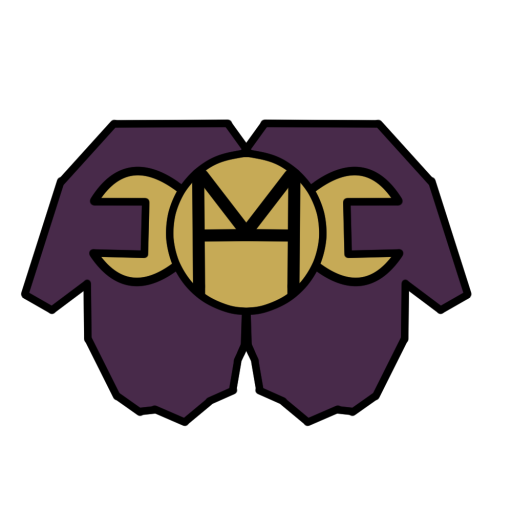

- [TÍTULO DE PROYECTO](#título-de-proyecto)
  - [Antecedentes](#antecedentes)
    - [Nombre del proyecto](#nombre-del-proyecto)
- [REQUISITOS](#requisitos)
  - [Requisitos funcionales](#requisitos-funcionales)
- [ANÁLISIS Y DISEÑO WEB](#análisis-y-diseño-web)
  - [Prototipo web y boceto de la estructura](#prototipo-web-y-boceto-de-la-estructura)
  - [Guía de estilos](#guía-de-estilos)
    - [Colores corporativos](#colores-corporativos)
    - [Logo](#logo)
  - [Planificación de tareas](#planificación-de-tareas)
  - [Base de datos](#base-de-datos)
    - [Diseño Entidad Relación de la BBDD](#diseño-entidad-relación-de-la-bbdd)
    - [Modelo relacional BBDD](#modelo-relacional-bbdd)
    - [Script de creación BBDD](#script-de-creación-bbdd)
    - [Consultas](#consultas)
  - [Validación de formularios](#validación-de-formularios)
  - [Proceso de carga](#proceso-de-carga)
  - [Jerarquía de directorios](#jerarquía-de-directorios)
    - [Contenido directorios](#contenido-directorios)
  - [Diseño de la interface](#diseño-de-la-interface)
    - [Estructura gráfica de la interface](#estructura-gráfica-de-la-interface)
- [IMPLEMENTACIÓN](#implementación)
  - [REQUISITO 1: Diseño responsive](#requisito-1-diseño-responsive)
    - [Funcionamiento](#funcionamiento)
    - [Ejemplo de código](#ejemplo-de-código)
  - [REQUISITO 2: ...](#requisito-2-)
- [PRUEBAS](#pruebas)
  - [Metodología de las pruebas](#metodología-de-las-pruebas)
- [DESPLIEGUE](#despliegue)
- [HERRAMIENTAS](#herramientas)
- [LENGUAJES](#lenguajes)
- [PRODUCTO](#producto)
  - [Página de Inicio](#página-de-inicio)
- [BIBLIOGRAFÍA](#bibliografía)

# TÍTULO DE PROYECTO
## Antecedentes
### Nombre del proyecto

El proyecto se llamará Handyman. El nombre hace alusión al personaje de ficción Candyman. Teniendo en cuenta el significado de la palabra handyman (manitas) y el personaje en cuestión, quiero que se le asocie la facilidad de aparición de Candyman al nombrarlo con la rapidez de los técnicos para que asistan al cliente. Para ello será necesaria una aplicación óptima que permita a los distintos técnicos encontrar trabajos cercanos de manera sencilla y rápida.

Se han utilizado distintos lenguajes de programación, como pueden ser PHP y JavaScript para
su desarrollo, y para su diseño se ha hecho uso de Clip Studio y de estilos CSS...

# REQUISITOS

Una empresa dedicada a la gestión y reparación de electrodomésticos varios busca mejorar la experiencia del cliente y los trabajadores. Para ello, encarga una aplicación con la que los usuarios podrán dar partes de averías de aquellos productos que tengan registrados.
## Requisitos funcionales

- La aplicación deberá tener una parte visible para todo el público que acceda a esta. Aunque no esté registrado. Para ellos necesitaremos controlar el acceso a diferentes páginas según el rol del usuario.

- Los usuarios registrados pertenecerán a uno de los tres tipos de roles, dependiendo del tipo de usuario que sea podemos encontrar los siguientes.

  - Cliente: podrá consultar sus datos personales (domicilios registrados, productos, etc). Este usuario podrá reportar averías de aquellos productos que ya tenga registrados. 
  
  - Técnico: podrá consultar sus datos personales y aceptar trabajos de reportes activos en ese momento.
  
  - Gestor: podrá consultar, modificar y eliminar los datos de cualquier usuario registrado en la página, así como registrarlos y añadir productos o domicilios a clientes que lo requieran. El gestor es el único que puede dar de alta a los demás usuarios. 

- Si un cliente es eliminado, también deberán eliminarse aquellos datos asociados a este. Tales como productos, domicilios y partes. Si algunos de los partes fue aceptado por algún técnico, este trabajo también quedará inválido eliminándolo de la Base de datos

- Si un técnico es eliminado, cualquier trabajo que haya realizado se borrará. Si hay algún trabajo sin acabar, este se borrará igual y el estado del parte del cliente pasará a "LIBRE", para que otros técnicos puedan aceptarlo. 
  
- Diseño responsive
  
- Control de errores en formularios
  - DNI
  - Teléfono
  - Mail
  - Teléfono 
  - Dirección
  
- Acceso restringido a usuarios no registrados  

# ANÁLISIS Y DISEÑO WEB

Breve descripción del mapa web. Se debe incluir la imagen del mapa web de vuestro proyecto.

Debe contener todo el itinerario de vuestra web. Todas las páginas y el hilo de navegación
## Prototipo web y boceto de la estructura

Mookup del proyecto. Deben coincidir el número de bocetos con el número de pantallas que hayais mostrado en el mapa web
## Guía de estilos

### Colores corporativos

Los colores corporativos de Handyman son el morado y amarillo. La elección de estos colores, a parte de gusto personal al ver cómo combinan, es por los siguientes motivos:

- Morado: escogí el morado ya que es un color que transmite elegancia y seriedad. También pienso que puede equilibrar el color amarillo que también presenta la empresa para que no sea tan intrusivo a la vista.
- Amarillo: el color amarillo es escogido para transmitir alegría, optimismo y cercanía al cliente. 

### Logo

El logo de la empresa son dos manos ofreciendo una herramienta a modo de caramelo. Volviendo al tema de la elección del nombre "handyman", expliqué que era una referencia a la leyenda urbana "candyman", candy (caramelo). 

Es un logo que, al igual que el amarillo, transmite cercanía y ofrece ayuda al cliente. La empresa se dedica a la reparación de electrodomésticos por lo que, una llave inglesa, es símbolo indiscutible de esto. 

El logo fue diseñado con Clip Studio Paint, un editor de imágenes profesional que permite la creación de imágenes vectoriales.



## Planificación de tareas


## Base de datos
### Diseño Entidad Relación de la BBDD


### Modelo relacional BBDD

Se muestra el diseño de la BBDD según el GUI que esteís usando. Deben aparecer todas las entidades en la 3FN, los campos de las tablas y las cardinalidades. 
### Script de creación BBDD

Scrip de creación de las BBDD, sin los datos. Cada una de las tablas con sus claves referenciadas. 

El lector debe comprender lo que está leyendo, no se pone el script sin más, hay que explicarlo.

### Consultas 

Se incluyen y describen todas las consultas que se emplean en el desarrollo del proyecto.

## Validación de formularios

Se incluyen todos los formularios que se emplean en la WEB y se especifican qué tipo de validación se va ha realizar.
## Proceso de carga

Descripción del proceso de carga de vuestra aplicación. Por ejemplo:

> Al introducir la URL proyecto.com en el navegador, el fichero “index.php” carga la plantilla, dependiendo del idioma (Esp, Eus o Ing), cargará una plantilla u otra, por defecto “plantillaEsp.html”.
> 
> El proceso se muestra en el siguiente diagrama:
>
>

## Jerarquía de directorios

Mostramos el árbol de directorios de nuestro proyecto WEB, tal y como lo visualizaríamos en la carpeta WWW.

Podemos usar la herramienta `tree -d` en entorno linux.


### Contenido directorios

Breve explicación de lo que tenemos contenido en cada directorio. Por ejemplo:

> `./` -> Contiene los ficheros principales “index.php”, “estilos.css”, “realizar_recomendacion.php”, “realizar_enviao.php”, “descargas.php” y “javascript.js”.
> 
> `descargas` -> Contiene los archivo PDF descargables desde el sitio web.
> 
> `Esp` -> Contiene las imágenes y las páginas web en español.
> 
> `Eus` -> Contiene las imágenes y las páginas web en euskera.
> 
> ...

## Diseño de la interface

En base al apartado [Prototipo web y boceto de la estructura](#prototipo-web-y-boceto-de-la-estructura) describimos el contenido de la interface de nuestra aplicación. Por ejemplo:

> El sitio web consta de cinco partes fundamentales. Esta estructura es común en todas las páginas que forman el sitio web.
> 
> **Cabecera**: Contiene el logo de la empresa, que está formado por las siglas “ostargi” cruzadas por una “O” mayúscula. Además, en la parte superior de la cabecera, está el menú de selección de idioma.
> 
> **Panel horizontal**: Esta ubicado justo debajo de la cabecera. Contiene los enlaces a las páginas: inicio, como llegar, contactar

### Estructura gráfica de la interface

Mostramos la estructura gráfica de nuestro diseño. Por ejemplo.


# IMPLEMENTACIÓN

Descripción detallada de cada requisito, incluyendo su funcionamiento, validaciones si fuesen necesarias, y cualqier información relevante.

**Por ejemplo:**

## REQUISITO 1: Diseño responsive

Cada vez hay mas usuarios de Internet que utilizan dispositivos móviles para navegar. Si nos fijamos en la analítica de nuestra web, nos damos cuenta que cada vez hay un gran numero de visitas que provienen de dispositivos móviles, por lo que las resoluciones a las cuales vemos nuestro desarrollo son diferentes.

La principal necesidad que existe para hacer un diseño «adaptable», es porque se pierden bastantes visitantes, al no tener el site adaptable a todos.
### Funcionamiento

Para incluir un diseño responsive en la WEB se ha empleado CSS, y el framework Bootstrap.
### Ejemplo de código

Para la zona de publicacione se ha empleado el siguiente código:

```css
.blog-pagination {
    margin-bottom: 4rem;
}
 
.blog-pagination > .btn {
    border-radius: 2rem;
}
 
 
.blog-footer {
    padding: 2.5rem 0;
    color: #999;
    text-align: center;
    background-color: #f9f9f9;
    border-top: .05rem solid #e5e5e5;
}
```
## REQUISITO 2: ...

Esto se realiza para cada uno de los requisitos de nuestra aplicación.

# PRUEBAS

Breve descripción de cómo se han realizado las pruebas. Por ejemplo:

> Para la realización de las pruebas he montado una máquina virtual con linux + apache + mysql + php.
> 
> A lo largo del desarrollo he subido diferentes versiones y comprobado las diferentes funcionalidades.

## Metodología de las pruebas

Descripción de las pruebas que se han realizado para probar el funcionamiento de toda la aplicación. 

Imprescindible comprobar el CRUD y el acceso público y privado de nuestra aplicación.

# DESPLIEGUE

Creación de un Script en BASH que permita el despliegue en automático de la aplicación en cualquier servidor linux, que contenga un Apache+PHP y una base de datos SQL.

Se copia y describe el funcionamiento del script.

# HERRAMIENTAS

Descripción de todas las herramientas que se han usado para el desarrollo del proyecto. Por ejemplo:

> Para la realización del proyecto se han empleado las siguientes herramientas:
> ## Visual Studio
> 
> Es un editor de código fuente desarrollado por Microsoft para Windows , Linux y macOS . Incluye soporte para depuración , control de Git integrado, resaltado de sintaxis , finalización de código inteligente , fragmentos de código y refactorización de código . Es gratuito y de código abierto.
> 
> ### Características
> 
> Control de GIT para subir y actualizar el repositorio de GitHub
> 
> ## Bootstrap
> 
> Bootstrap es un framework CSS y Javascript diseñado para la creación de interfaces limpias y con un diseño responsive. Además, ofrece un amplio abanico de herramientas y funciones, de manera que los usuarios pueden crear prácticamente cualquier tipo de sitio web haciendo uso de los mismos
> 
> ### Características
> 
> Uso de clases para que la página sea responsive.
> 
> ## WAMP
> 
> WAMP es un acrónimo que significa Windows, Apache, MySQL y PHP. Es un stack o conjunto de soluciones de software que significa que cuando instalas WAMP, estás instalando Apache, MySQL y PHP en tu sistema operativo (Windows en el caso de WAMP)
> 
> ## CLIP STUDIO
> 
> Clip Studio Paint (antiguamente Manga Studio 5 o ComicStudio en Japón) es una aplicación de ilustración para Mac OS X y Microsoft Windows desarrollado por Celsys para la creación digital de cómics e ilustraciones, entre otras cosas.
> 
> ### Características
> 
> Dibujo vectorial para la creación del logo.
> 
# LENGUAJES

Descripción de los lenguajes y frameworks utilizados para el desarrollo del proyecto. Por ejemplo:

> ## HTML
> 
> HTML es un lenguaje de marcado que se utiliza para el desarrollo de páginas de Internet.
> 
> ### Características
> 
> Utilizado en las vistas de nuestra página WEB.
> 
> ## CSS
> 
> CSS son las siglas de “Cascading Style Sheets” (hojas de estilo en cascada). CSS es un lenguaje para la composición y estructuración de páginas web (HTML o XML)
> 
> ### Características
> 
> Dar formato y color a la página para que esta sea más accesible y vistosa.
> 
> ## JAVASCRIPT
> 
> JavaScript (abreviado comúnmente JS) es un lenguaje de programación interpretado, dialecto del estándar ECMAScript. Se define como orientado a objetos,​ basado en prototipos, imperativo, débilmente tipado y dinámico.
> 
> ### Características
> 
> Uso exclusivo para la validación de datos en los formularios.
> 
> ## PHP
> 
> PHP es un lenguaje de programación destinado a desarrollar aplicaciones para la web y crear páginas web, favoreciendo la conexión entre los servidores y la interfaz de usuario.
> 
> ### Características
> 
> Con PHP desarrollaremos el Backend completamente y determinadas partes del front.
> 

# PRODUCTO

Se muestran diferentes pantallas que constituyen el desarrollo final de la aplicación:

## Página de Inicio


Y lo vamos realizando con todas las pantallas.
# BIBLIOGRAFÍA

Incluye la bibliografía y webgrafía que hayas empleado para el desarrollo de tu proyecto.


